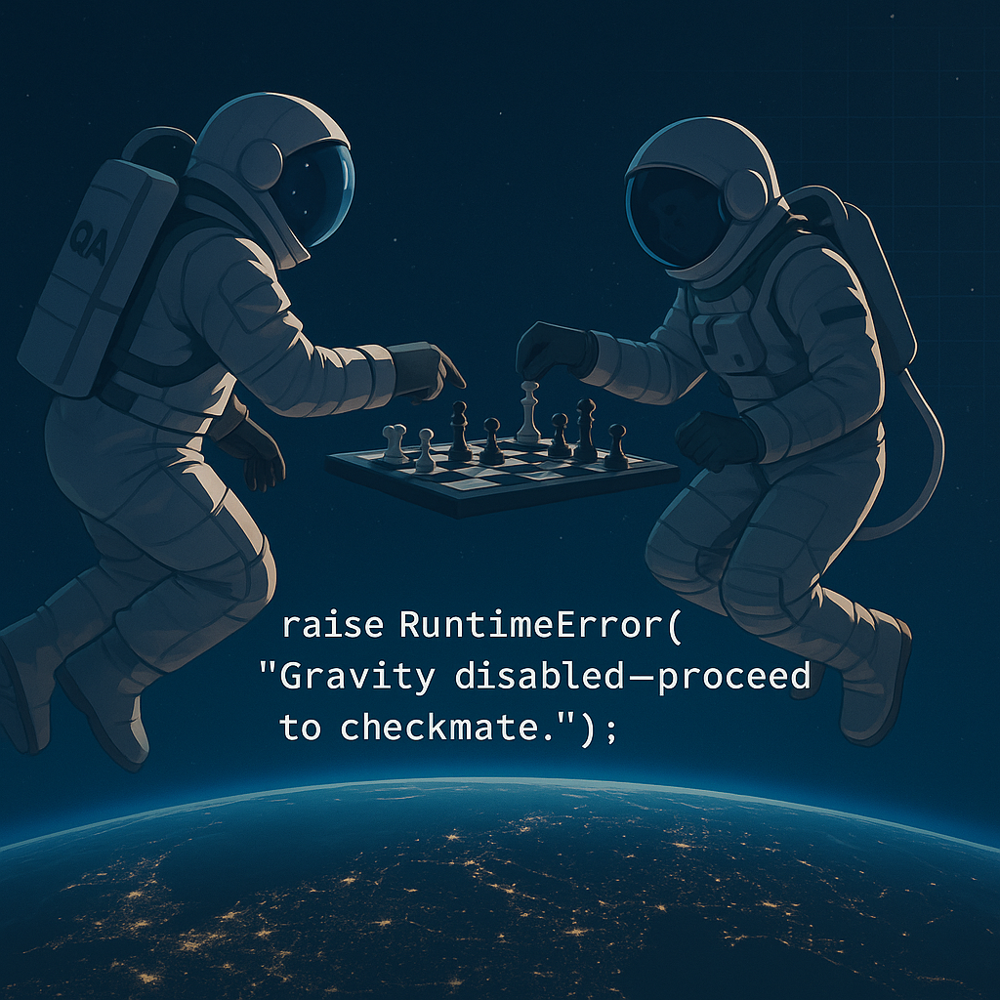

# 🧪 QA Automation Project: Frontend & API Testing

Welcome to our group's two-part QA Automation project. This project demonstrates both **frontend UI testing** and **backend API validation**, built using Python's `unittest` framework.

---

## 🚀 Project Overview

### 🔹 Part 1: Frontend UI Testing – `apple.com`

- Automated using **Selenium WebDriver**
- Validates key UI elements, page titles, navigation flow, and responsiveness
- Organized with **Page Object Model** for scalability
- Built with Python `unittest`

### 🔹 Part 2: API Testing – `x-ai.com`

- Tests REST APIs for correct responses, status codes, and data structures
- Validates authentication, error handling, and edge cases

---

## 🧱 Project Structure

Project Folder/  
├── 01_Documentation  
├── 02_Front_end_Testing  
│   ├── Tatsiana Lentz  
│   ├── Milana Binaminova    
│   ├── Sergiy Borovich      
│   ├── Viktor Pervushkin     
│   ├── Assiya Beribassova    
│   ├── Lina Gorelik   
│   ├── Daria Bataeva  
│   └── Anton Buyanovski           
├── 03_Performance_testing  
│ ├── GTmetrix  
│ ├── Lighthouse     
│ └── SpeedLab         
├── 04_Security_testing  
│ ├── HTTP Observatory  
│ ├── Astra  
│ └── Other Security Testing Tools  
├── 05_API_Testing  
│ ├── data/ # Sample payloads or config  
│ ├── pages/ # Page Object Model classes  
│ └── utils/ # Helpers   
├── 06_Bug_Reports  
│   ├── Tatsiana Lentz  
│   ├── Milana Binaminova  
│   ├── Sergiy Borovich      
│   ├── Viktor Pervushkin     
│   ├── Assiya Beribassova    
│   ├── Lina Gorelik   
│   ├── Daria Bataeva  
│   └── Anton Buyanovski           
└── README.md # You're here!  

---

## 🧪 Technologies Used

- Python 3.x  
- `unittest` (core framework)  
- `selenium` for browser automation  
- `requests` for API testing  
- `HTMLTestRunner` for reports  
- Git & GitHub for version control  
- Optional: Jenkins / GitHub Actions for CI

## 👥 Team
| Name                          | Link                                   | 
|-------------------------------|----------------------------------------|
| Sergey Efremov (Project Lead) | https://www.linkedin.com/in/sefremoff  |
| Tatsiana Lentz (QA Lead )     | www.linkedin.com/in/tatsianalentz      |
| Milana Binaminova             | www.linkedin.com/in/milana-binaminova  |
| Sergiy Borovich               | www.linkedin.com/in/sergiy-borovich    |
| Viktor Pervushkin             | www.linkedin.com/in/viktp              |
| Assiya Beribassova            | www.linkedin.com/in/assiya-beribassova |
| Lina Gorelik                  | www.linkedin.com/in/lina-gorelik       |
| Daria Bataeva                 | www.linkedin.com/in/daria-bataeva      |
| Serine Zargaryan              | https://www.linkedin.com/in/serinezargaryan/ |
| Anton Buyanovski              | www.linkedin.com/in/antonb-qa          |

# Apple-and-X-AI-testing-project
Apple and X-AI testing project: FE, API, Performance and Security testing, Cloud Automation testing, QA-Documentation. https://www.apple.com/ , https://x.ai/
