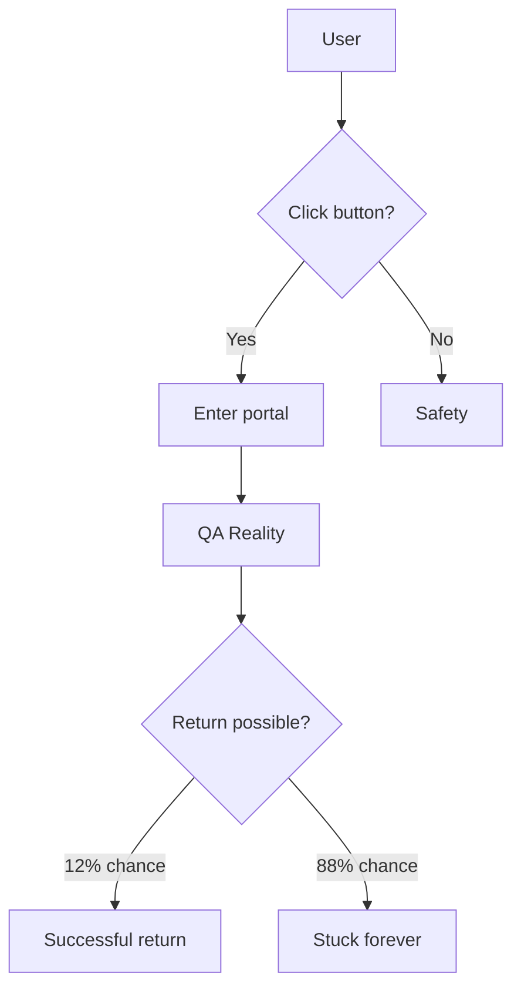

1.

----
2. 

# 🚨 DANGER ZONE 🚨

⚠️ <strong>WARNING: DO NOT CLICK THE BUTTON BELOW</strong> ⚠️

### You risk being transported into an alternate QA-powered virtual reality!

  

> 🎭 **Final Warning:** This link may alter your perception of reality forever...

 

**👇 If you still dare to proceed... 👇**

-----
3.

# 🎮 QUEST: Virtual Reality Portal

<table>
<tr>
<td align="center">

### 📊 Danger Level

**EXTREME** 🔥

</td>
<td align="center">

### 🎯 Success Rate

**VERY LOW** 💀

</td>
</tr>
</table>

---

### ⚠️ MISSION BRIEFING ⚠️

> **Target:** Unknown portal to QA virtual reality  
> **Status:** 🔴 Extremely dangerous  
> **Recommendation:** Stay away!  

🪠<strong>Accept the challenge? (Click to expand)</strong>

 
 

-----
4.

# 🛸 INTERDIMENSIONAL PORTAL

---

## 📋 ANOMALY DOSSIER

| Parameter | Value | Note |
|-----------|-------|------|
| 🌍 **Type** | Virtual Reality | QA-powered |
| ⚡ **Energy** | 9,847 TeV | Critical level |
| 🕳️ **Stability** | 23% | Extremely unstable |
| 🧬 **Bio-compatibility** | Unknown | ⚠️ Not tested |

🔬 <strong>SCIENTIFIC DATA</strong> (Click to view)

 

### 📊 Risk Analysis

5. 

# 🕹️ GAME OVER... OR NOT?

🲠<strong>Choose your action</strong>

 

### 🎯 Battle Statistics

<table>
<tr>
<td align="center">

**🏃‍♂️ ESCAPE**  
Success: 85%  

</td>
<td align="center">

**⚔️ ENTER PORTAL**  
Success: 15%  

</td>
</tr>
</table>

---

### 💭 What will you choose?

> 🧙‍♂️ **Wise Wizard says:**  
> "Many have entered this portal, young traveler.  
> Few have returned to tell the tale..."

 

**🎮 BOSS BATTLE:**

*Press START to continue... if you dare* 🕹️

